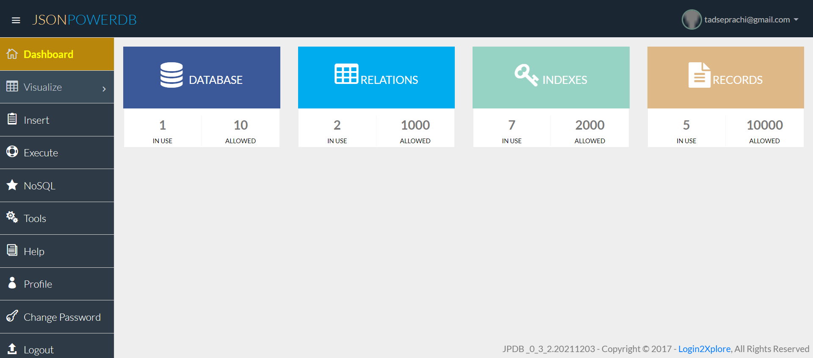

# Employee-Data
> Employee Data is a WebProject Created Using HTML,CSS,JSONPOWERDB
## JsonPowerDB
> This mini-project performs CRUD operations using JsonPowerDB.
> JsonPowerDB is a high performance, creative and disruptive multi-mode DBMS.

## Some features of JsonPowerDB are:
* Nimble, simple to use, in memory, real time
* Schema free - easy to maintain
* Serverless support - fast development - cuts time to market
* Built around the world's fastest indexing engine PowerIndex
* Webservices API - Low Dev Cost
* Multiple Security Layers
* A single instance - Million Indexes
* Inbuilt support for querying multiple databases
* Serverside Native NoSQL - best performance
* Multi-mode database - One solution to a variety of data
## Use cases:
- All RDMS use cases.
- All key-value use cases.
- All document use cases.
- Time series/geospatial analytics.
- Real time application for data analytics.
- Live working HTML templates.
- Any software application that needs backend DB. (Dynamic web-apps/Mobile/Desktop Apps)
## Employee Data

## JsonPowerDB

